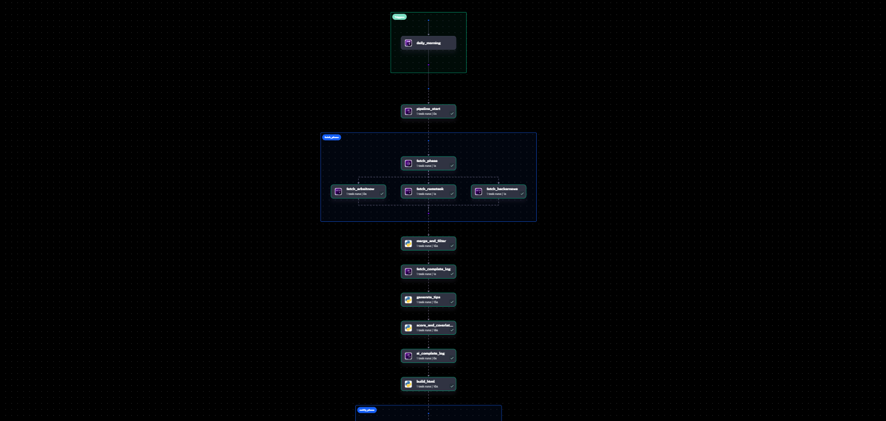
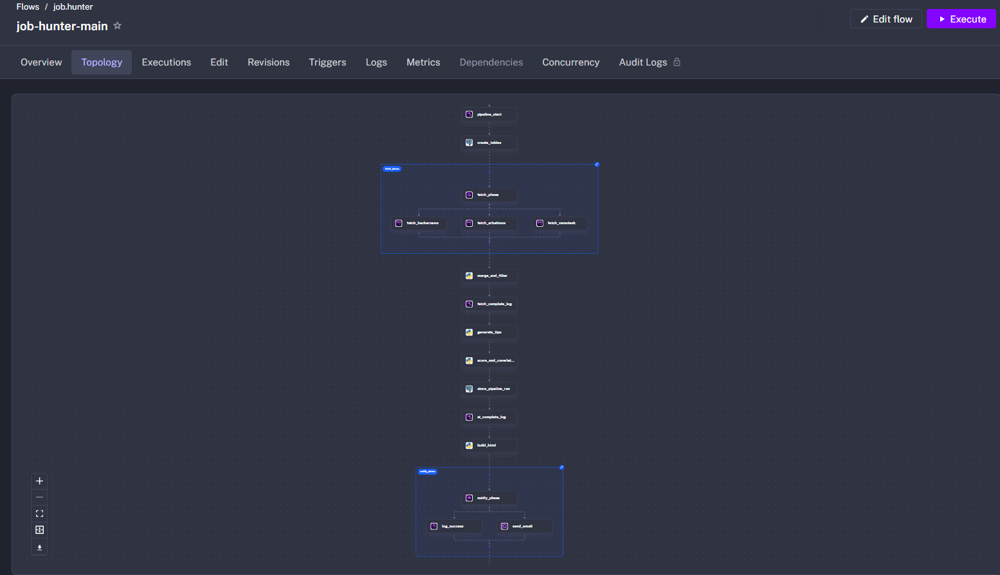
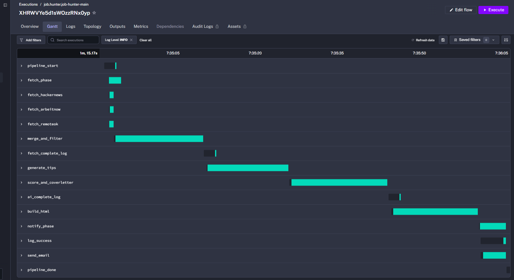
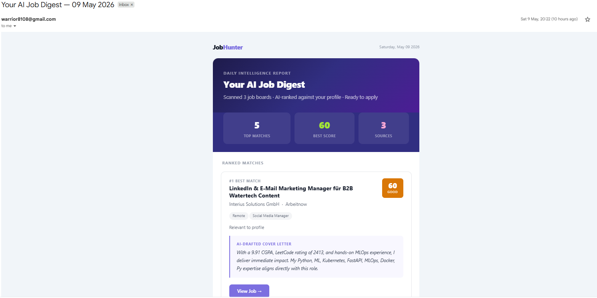

# Job-Hunt-Autopilot 🚀

A comprehensive automated job application tracking system powered by **Kestra**. This project uses Kestra workflows to track job applications via webhooks, store the data in PostgreSQL, and automate weekly follow-up reminders.

## Features

- **Webhook Tracking**: Automatically log job applications from any platform that can send webhooks.
- **Database Storage**: Securely stores application data (Company, Role, Application Date, Status) in PostgreSQL.
- **Instant Confirmation**: Sends beautifully formatted HTML emails immediately upon logging an application.
- **Automated Follow-ups**: Runs a scheduled cron job every Monday to check for applications older than 7 days and sends you an email reminder with a pre-formatted follow-up template.
- **Database Synchronization**: Automatically updates the `followup_sent` status in the database to ensure you don't follow up on the same application multiple times.

## Workflows Included

1. **`job-hunter-tracker.yml`**: 
   - Triggered by a Webhook (`/api/v1/executions/webhook/job.hunter/job-hunter-tracker/job-application-tracker-2026`).
   - Expects payload with `job_title`, `company`, and `url`.
   - Inserts the record into the `jh_applications` PostgreSQL table.
   - Sends a confirmation email.

2. **`job-hunter-followup.yml`**:
   - Triggered by a CRON Schedule (Every Monday at 10:00 AM IST).
   - Queries PostgreSQL for applications older than 7 days where a follow-up hasn't been sent.
   - Marks those records as `followup_sent = TRUE`.
   - Sends an email containing an actionable follow-up template.

## Prerequisites

- **Docker & Docker Compose**: For running the local Kestra and PostgreSQL services easily.
- **SMTP Credentials**: Gmail SMTP credentials for sending emails (update the `username` and `password` in the mail tasks).

## Quick Setup

1. **Start the Environment**
   Run the included Docker Compose file to instantly spin up Kestra and a PostgreSQL database configured exactly as the workflows expect:
   ```bash
   docker-compose up -d
   ```
   Kestra will be available at `http://localhost:8080`.

2. **Configure Email**
   Update the SMTP credentials (`username` and `password`) in both `.yml` files to your own. If using Gmail, use an [App Password](https://myaccount.google.com/apppasswords).

3. **Import Workflows**
   Open `http://localhost:8080` in your browser, go to **Flows**, and import both `job-hunter-tracker.yml` and `job-hunter-followup.yml`.

4. **Start Tracking**
   Set up your browser extension or webhook sender to POST data to the Kestra webhook URL when you apply for a job.

### Webhook Payload Example

```json
{
  "job_title": "Senior Software Engineer",
  "company": "Tech Innovators Inc.",
  "url": "https://techinnovators.com/careers/123"
}
```

## Screenshots & Outputs

Here are some visuals of the workflows and execution outputs:

| Flow Graph & Topology | Execution Gantt & Email |
| :---: | :---: |
|  <br>  |  <br>  |

*Additional visuals: [Kestra Architecture](./Outputs/Architect_kestra.png), [Kestra Certificate](./Outputs/Certificate-Kestra.png)*

## License

This project is licensed under the MIT License.
